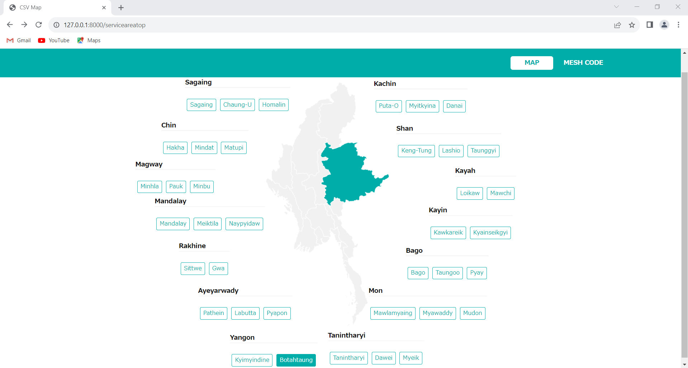
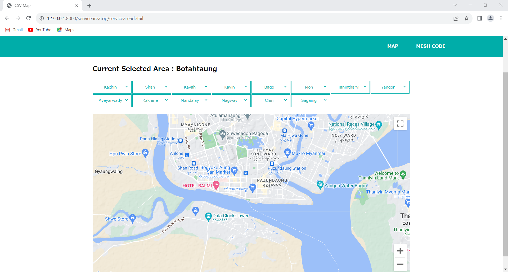
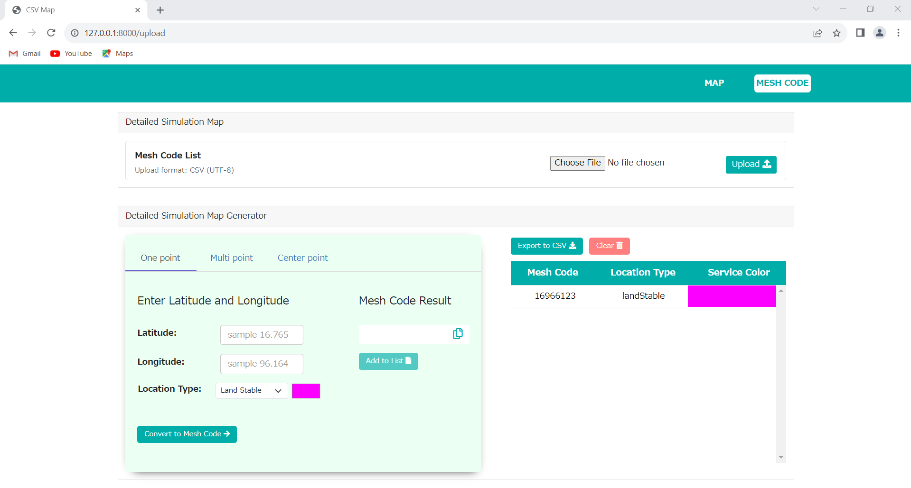
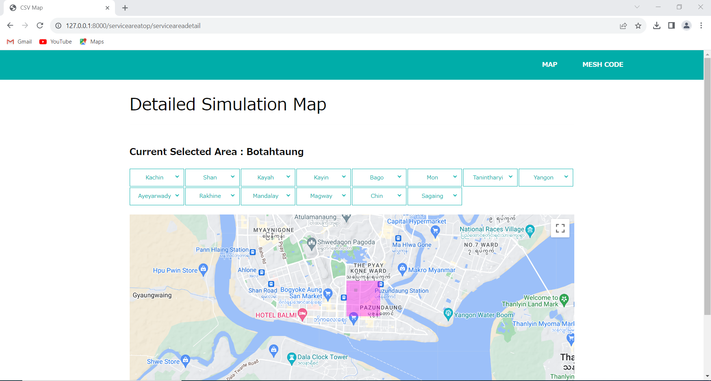
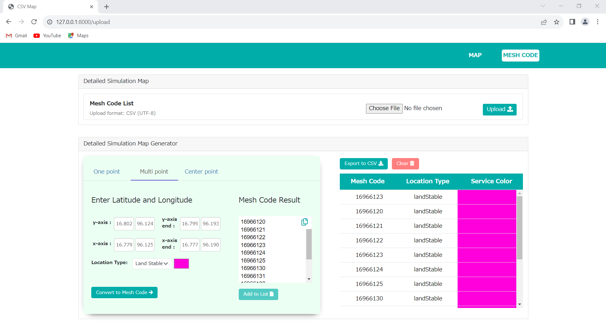
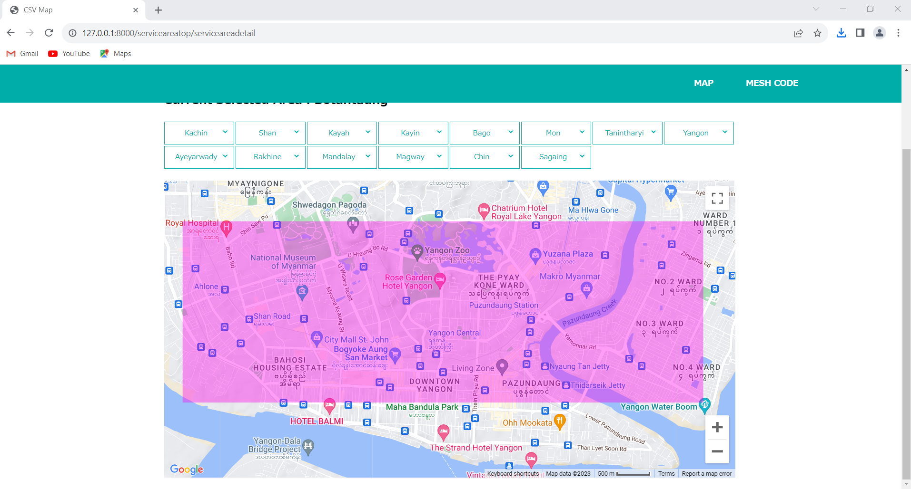
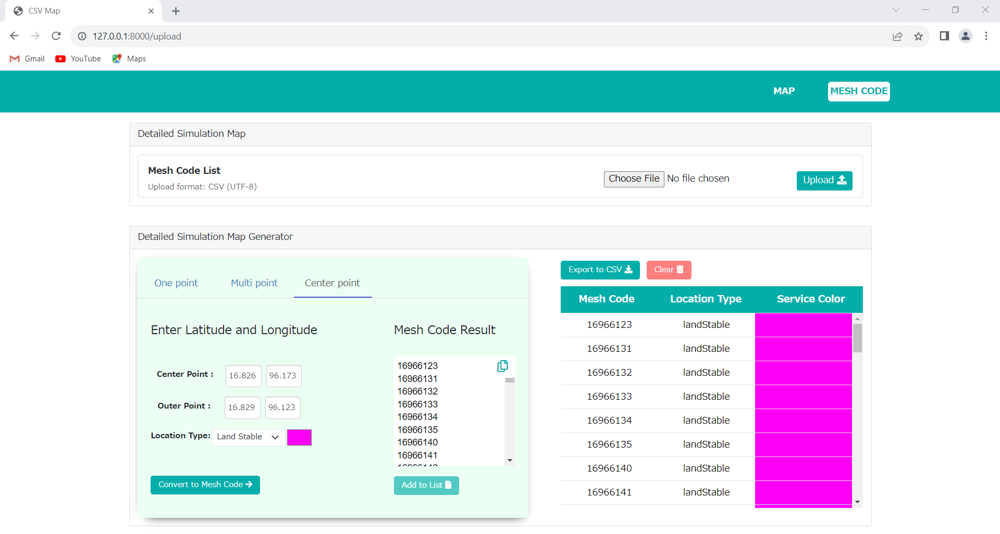
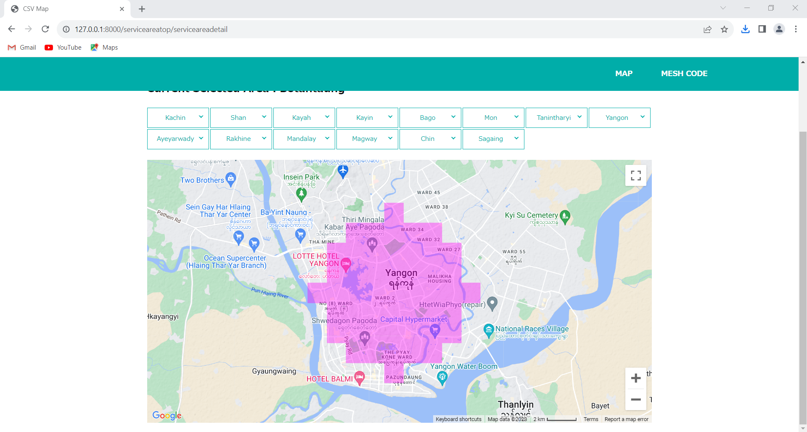
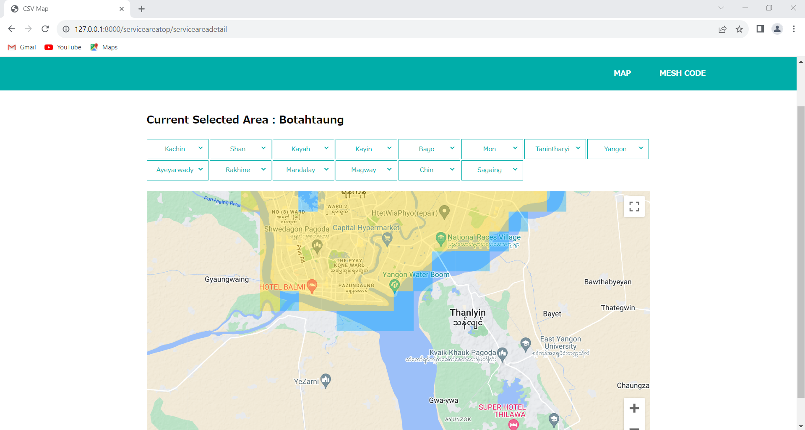

# Available Features :


#### 1. Region Highlight with hover effect
#### 2. Point to clicked region
#### 3. Highlight in map region for available service

  - lat, lng to mesh code generate
  - mesh code to tile layer png
  - can custom change color from UI for land and sea
  - generate color with circle or rectangle for multiple area

# Requirements :

    php : ^7.3|^8.0
    laravel : ^8.75

# Installation :

  ### git clone 

  ```
  https://github.com/Yair-Htut-Khaung-SCM/ServiceAreaMap.git 
  ```
  ### Generate Google Map Javascript API

  #### 1. Visit the Google Cloud Console:
Go to the  [Google Cloud Console](https://console.cloud.google.com/).

  #### 2. Create a Project:
If you don't have a project, create one by clicking on the project dropdown at the top and selecting "New Project."

  #### 3. Enable APIs and Services:

In the Cloud Console, navigate to the `APIs & Services > Dashboard` page.
Click on the ` + ENABLE APIS AND SERVICES` button.
Search for `Maps JavaScript API` and select it.
Click the "Enable" button.

  #### 4. Create Credentials:

After enabling the API, click on `Create Credentials`.
Choose "API Key" from the dropdown.
Configure API Key:

You can restrict the API key for better security. Options include restricting it to certain IP addresses or specific websites.
Set application restrictions if needed.


### Set it in lyaouts/app.blade.php and serviceareamap.js

```
    if (getenv('APP_ENV') === 'local') {
        $_GOOGLE_MAP_API_KEY = 'xxxxxxxxxxxxxxxxxxxxxxxxxx';
    } else {
        $_GOOGLE_MAP_API_KEY = 'xxxxxxxxxxxxxxxxxxxxxxxxxx';
    }
```
```
const GOOGLE_MAP_API_KEY = 'xxxxxxxxxxxxxxxxxxxxxxxxxx';
```

  
Go to project folder
```
cd serviceareamyanmar
```

Install dependencies
```
composer install
```

Enviromnent Setup
```
cp .env.example .env
```

Linking Storage with Public
```
php artisan storage:link
```

Run below command
```
 php artisan serve 
```

# Main Screen

```
http://127.0.0.1:8000/serviceareatop
```

### Region Highlight with hover effect



### Point to clicked region




lat long to mesh list for one point



and export meshcode and import 



lat long to mesh list for multipoint - y-axis, y-axis-end , x-axis, x-axis-end



and export meshcode and import meshcode



lat long to mesh list for centerpoint - centerpoint and outerpoint



and export meshcode and import meshcode



### Highlight in map region for available service with custom color





